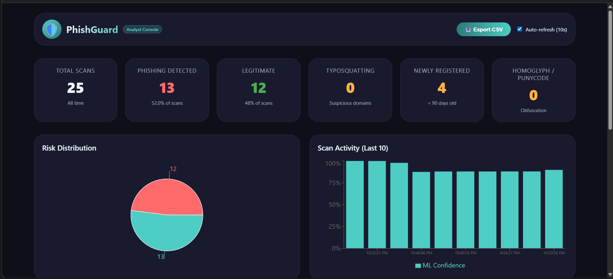
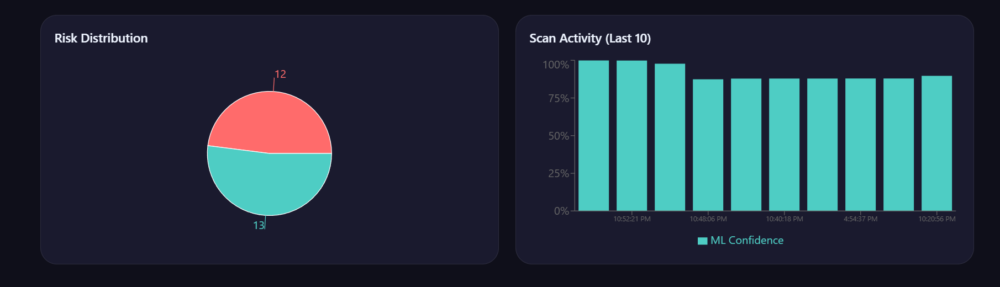
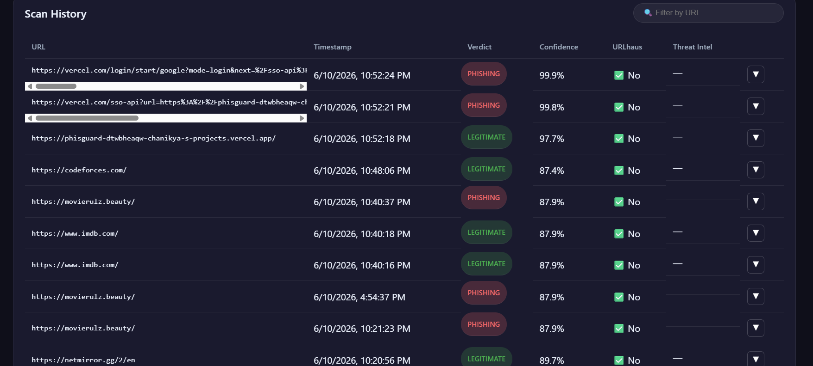
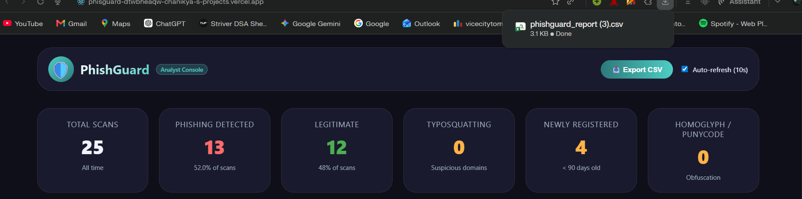
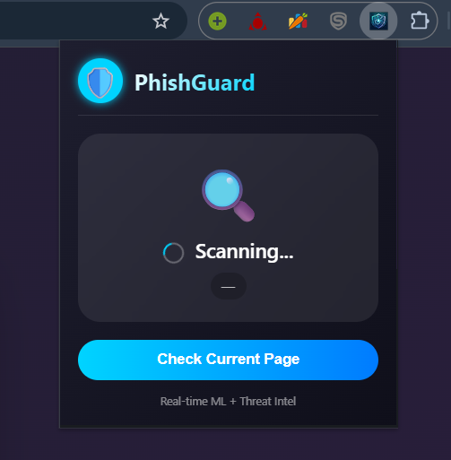
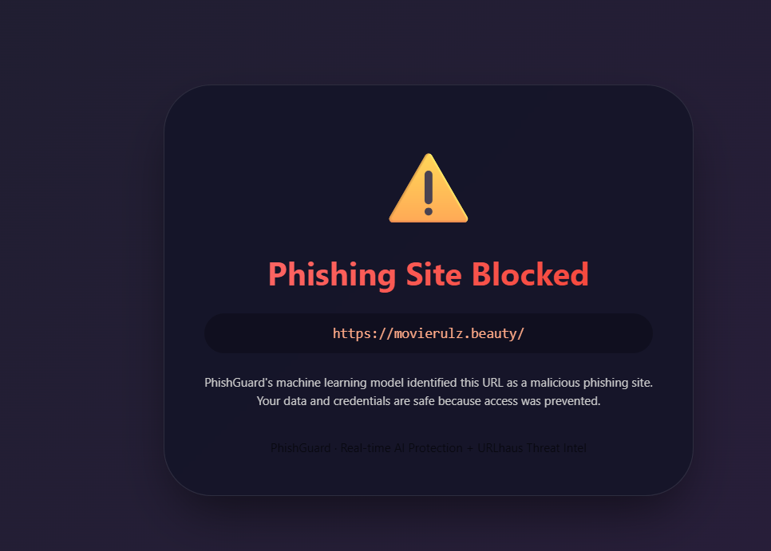

# 🛡️ PhishGuard

> An end-to-end phishing detection system combining machine learning, live threat intelligence, and a real-time browser extension — with a React analyst dashboard for security teams.


---

## Overview

Unlike traditional static blacklists, PhishGuard uses an **XGBoost classifier** trained on **22 URL-based features** — length, digit ratio, obfuscation, TLD entropy, and more — augmented with live lookups from URLhaus, DNS, WHOIS, and typosquatting detection.

The result is a low-latency (**<500ms**), high-accuracy system that catches newly registered phishing domains often missed by conventional tools.

---

## Features

### 🖥️ Frontend — React Dashboard

| Feature | Description |
|---|---|
| 📊 Live Statistics | Total scans, phishing vs. legitimate counts, and threat indicators — typosquatting, newly registered domains, homoglyph/punycode |
| 📈 Interactive Charts | Pie chart for verdict distribution and a bar chart for ML confidence scores across recent scans |
| 🔍 Searchable Scan History | Filter by URL with a paginated, expandable table showing detailed threat intel — decoded URL, DNS, WHOIS, typosquatting score |
| 📥 CSV Export | One-click download of all scans for IoC reporting and offline analysis |
| 🔄 Auto-Refresh | Configurable 10-second polling keeps threat data current without manual reload |


| Live Tracking | Charts |
|---|---|
|  |  |

| Scan History | CSV Export |
|---|---|
|  |  |


### 🧩 Chrome Extension

| Feature | Description |
|---|---|
| ✅ Real Chrome Extension | Installs as a genuine Manifest V3 extension — works just like any extension in day-to-day browsing |
| 🚫 Blocked Page | Intercepts navigation to phishing sites with a pop-up warning, preventing users from reaching the malicious page |

| Extension | Blocked Page |
|---|---|
|  |  |

### ⚙️ Backend — Flask API

| Feature | Description |
|---|---|
| 🧠 ML Prediction | Random Forest + Stacking Classifier extracts 22 features from a URL and classifies in real time |
| 📡 Live Threat Intel | URLhaus malicious URL lookup, live DNS/WHOIS, and typosquatting detection against 35 trusted domains |
| 👁️ Obfuscation Decoding | Strips percent encoding, homoglyphs, and punycode before analysis to catch disguised URLs |
| 🗄️ Scan History | Recent scans stored in Supabase (capped at 100), with full CSV export support |

---

## Tech Stack

| Layer | Technologies |
|---|---|
| **Backend API** | Python, Flask, Flask-CORS, Gunicorn |
| **ML Pipeline** | scikit-learn, XGBoost, joblib, NumPy |
| **Database** | Supabase (PostgreSQL) + psycopg2-binary |
| **Threat Intel** | URLhaus API, python-whois, dnspython, tldextract |
| **Frontend** | React 18, Axios, Recharts, react-loader-spinner, CSS3 dark theme |
| **Extension** | Manifest V3, JavaScript, HTML/CSS |
| **Deployment** | Render (backend), Vercel (dashboard), Chrome Web Store (extension) |
| **Version Control** | Git + GitHub |

---

## Getting Started

### 🧩 Extension Setup

1. Clone the repository or download the `ReactUI/phisguard_extension` folder:
   ```bash
   git clone <repo-url>
   ```

2. Open `chrome://extensions` in Chrome and enable **Developer Mode**.

3. Click **Load unpacked** and select the `phisguard_extension` folder.

4. Browse websites — scans will appear automatically in the dashboard.

🔗 **[View Live Dashboard](https://phisguard-dtwbheaqw-chanikya-s-projects.vercel.app/)**

---

### 🛠️ Local Setup

#### Backend (Flask API)

```bash
cd Backend
pip install -r requirements.txt

# Set your Supabase credentials
set SUPABASE_URL=your_project_url
set SUPABASE_KEY=your_service_role_key

python backend_final.py
```

> Create a free project at [supabase.com](https://supabase.com) to get your `SUPABASE_URL` and `SUPABASE_KEY`.

#### Frontend (React Dashboard)

```bash
cd "React UI/phishguard-dashboard"
npm install
npm start
```

#### Extension

Follow the same [Extension Setup](#-extension-setup) steps above after cloning.

---


## Deployment

| Service | Platform |
|---|---|
| Backend API | [Render](https://render.com) |
| React Dashboard | [Vercel](https://vercel.com) |
| Chrome Extension | [Chrome Web Store](https://chrome.google.com/webstore) |